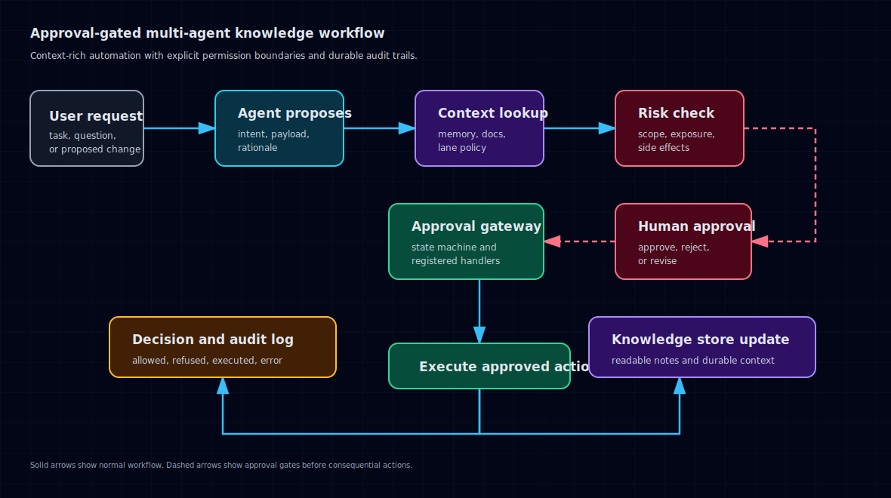

# New Ocean Agent OS

A compact framework for running multiple AI agents against one shared knowledge base.

New Ocean Agent OS gives each agent explicit lanes for reading, writing, and appending. Every attempted write is checked against policy and recorded in an audit log.

## Features

- Markdown-based knowledge storage
- Agent-specific lane policies
- Read, write, and append-only access modes
- Closed-by-default permissions
- Audit logging for allowed and refused actions
- Minimal two-agent example

## Architecture



The system separates knowledge work from consequential action. Agents can gather context, write to approved lanes, and propose follow-up work. Riskier actions move through an approval gateway before execution.

```text
Scribe agent      Curator agent      Reviewer agent
     |                 |                  |
     v                 v                  v
+------------------------------------------------+
| Lane policy                                    |
| logs/*: write                                 |
| knowledge/*: write                            |
| decisions/*: append                           |
+------------------------------------------------+
     |                 |                  |
     v                 v                  v
+------------------------------------------------+
| Markdown knowledge store                       |
+------------------------------------------------+
     |
     v
+------------------------------------------------+
| Audit log                                      |
+------------------------------------------------+
```

## Quick start

```bash
git clone https://github.com/parkbenchepiphany/new-ocean-agent-os
cd new-ocean-agent-os
pip install -e .
python examples/two_agents.py
```

## Access modes

| Mode | Grants | Typical use |
| --- | --- | --- |
| `read` | Read matching paths | Reference material |
| `write` | Create and replace matching paths | Raw logs, drafts, maintained knowledge |
| `append` | Create and append only | Decision logs, audit trails |

## Example

```python
from noaos import Agent, AuditLog, KnowledgeStore, LanePolicy

store = KnowledgeStore("kb")
audit = AuditLog("kb/audit.jsonl")
policy = LanePolicy.from_config({
    "agents": {
        "scribe": [{"paths": ["logs/*"], "mode": "write"}],
        "curator": [
            {"paths": ["knowledge/*"], "mode": "write"},
            {"paths": ["decisions/*"], "mode": "append"},
        ],
    }
})

scribe = Agent("scribe", store, policy, audit)
curator = Agent("curator", store, policy, audit)

scribe.remember("logs/today", "raw observation")
curator.remember("knowledge/item", "curated knowledge")
curator.log_to("decisions/log", "decision rationale")
```

## Example workflows

- [Approval-gated research workflow](examples/approval_gated_research_workflow.md)
- [Example operating model](examples/operating_model.md)

## License

MIT. See [LICENSE](LICENSE).
